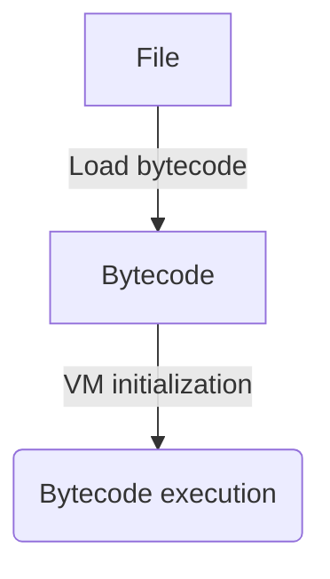

# W8 Architecture
This document describes the architecture of W8.

## Table of Contents
- [Definitions](#definitions)
- [W8 in More Detail](#w8-in-more-detail)
- [Pipeline](#pipeline)
  - [Bytecode](#bytecode)
  - [Memory Allocation](#memory-allocation)
  - [Bytecode Execution](#bytecode-execution)
- [Where Everything Is Located](#where-everything-is-located)

## Definitions
- **“Opcode”** — the operation code of an instruction that determines the instruction's type. An opcode is represented as a single byte.
- **“Operand”** — an argument of an instruction that can be either a register or an immediate value.
- **“Instruction”** — a command that performs a specific operation. Each instruction has an opcode that determines its type and may have operands that specify arguments for the operation.
- **“Bytecode”** — a sequence of instructions represented as bytes.

---

## W8 in More Detail
W8 has 255 64-bit registers. Each instruction contains:
- 1 opcode;
- 3 optional operands.

There are 2 types of operands:

- Register (1 byte);
- Immediate value (8 bytes).

## Pipeline


Let's go through each stage:

### Bytecode
First, W8 loads bytecode from a file in the W8 Bytecode format (see the [documentation](../File-Format/FILE-FORMAT.md)).

The loader checks:
- the file header;
- whether W8 can execute the bytecode (whether the version is supported).

After the header, the loader starts reading instructions.

Instructions are read as follows:
1. Read the instruction opcode (1 byte).
2. Determine the number of operands following the opcode (1 byte).
3. Determine how many bytes the next operand occupies based on its tag (`0x00` — register, 1 byte; `0x01` — immediate value, 8
  bytes).
4. Read the operand.

Steps 3 and 4 are repeated for each operand of the instruction.

The result is a `Vec<Instruction>`.

---

### Memory Allocation
After the bytecode has been loaded, W8 allocates memory (64 KB by default if no memory size was specified) for program execution.
The memory itself is simply a sequence of bytes that can be interpreted in any way.

#### Why Memory Is Needed
Memory is needed when there are not enough registers to store data.

---

### Bytecode Execution
After the bytecode has been loaded and memory has been allocated, the program is executed. W8 executes bytecode.

#### What Is Direct Threading?
Instead of dispatching on the opcode in the hot loop, the program is **once** encoded into a flat array of numbers. Each
instruction takes 4 slots of 8 bytes:
```text
[handler address] [operand1] [operand2] [operand3]
```
The first slot stores the **address of the instruction handler**, chosen by the opcode and operand kinds. The jump table is used
only at encoding time — it is absent from the hot loop.

When executing an instruction, W8:
1. Reads the handler address from the instruction header.
2. Jumps directly to the corresponding handler.
3. The handler executes the instruction (operands are read via a raw pointer, without parsing their kinds).
4. The handler returns the index of the next instruction.

---

## Where Everything Is Located
- ISA:
  - Module path: `w8-core/src/isa/`
  - Opcode enumeration: [`isa/opcode.rs`](../../w8/w8-core/src/isa/opcode.rs)
  - Operand types and structure: [`isa/operand.rs`](../../w8/w8-core/src/isa/operand.rs)
  - `Register` structure: [`isa/register.rs`](../../w8/w8-core/src/isa/register.rs)
  - Instruction structure: [`isa/instruction.rs`](../../w8/w8-core/src/isa/instruction.rs)
  - Error enumeration: [`isa/err.rs`](../../w8/w8-core/src/isa/err.rs)
- Loader:
  - Module path: `w8-core/src/loader/`
  - Loader implementation: [`loader/mod.rs`](../../w8/w8-core/src/loader/mod.rs)
  - Error enumeration: [`loader/err.rs`](../../w8/w8-core/src/loader/err.rs)
- VM:
  - Module path: `w8-core/src/vm/`
  - VM structure definition: [`vm/mod.rs`](../../w8/w8-core/src/vm/mod.rs)
  - Error enumeration: [`vm/err.rs`](../../w8/w8-core/src/vm/err.rs)
  - Executor module: `vm/interpreter/`
  - Memory structure: [`vm/memory.rs`](../../w8/w8-core/src/vm/memory.rs)
  - Register file: [`vm/register_file.rs`](../../w8/w8-core/src/vm/register_file.rs)
