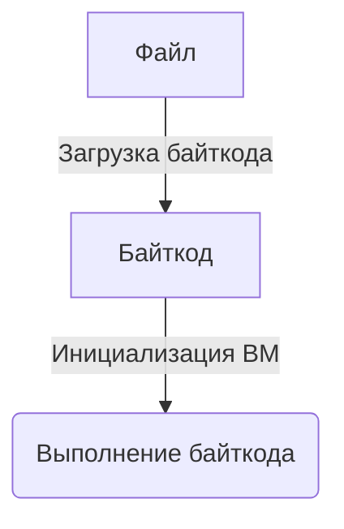

# Архитектура W8
Этот документ описывает архитектуру W8.

## Содержание
- [Определения](#определения)
- [Поподробнее про W8](#поподробнее-про-w8)
- [Pipeline](#pipeline)
    - [Байткод](#байткод)
    - [Выделение памяти](#выделение-памяти)
    - [Выполнение байткода](#выполнение-байткода)
- [Что где находится](#что-где-находится)

## Определения
- **«Опкод»** — это код операции инструкции, который определяет тип инструкции. Опкод представлен в виде одного байта.
- **«Операнд»** — это аргумент инструкции, который может быть регистром или immediate значением.
- **«Инструкция»** — это команда, которая выполняет определённую операцию. Каждая инструкция имеет опкод, который определяет её
    тип, и может иметь операнды, которые задают аргументы для этой операции.
- **«Байткод»** — последовательность инструкций, представленных в виде байтов. 

---

## Поподробнее про W8
В W8 255 64-битных регистров. Одна инструкция содержит в себе:
- 1 опкод;
- 3 операнда (опциональных).

Есть 2 вида операнда:
- Регистр (1 байт);
- Immediate-число (8 байт).

## Pipeline

Разберём каждый этап:

### Байткод
Сначала W8 загружает байткод из файла с форматом W8 Bytecode (см. [документацию](../File-Format/FILE-FORMAT.ru.md)).
Загрузчик проверяет:
- заголовок файла;
- может ли W8 выполнить байткод (поддерживается ли версия).

После заголовка, загрузчик начинает читать инструкции.

Читает инструкции он следующим образом:
1. Читает опкод инструкции (1 байт).
2. Определяет количество операндов, которые идут после опкода (1 байт).
3. Узнаёт сколько байт занимает следующий операнд (1 байт) по тегу (0x00 — регистр, 1 байт; 0x01 — immediate значение, 8 байт).
4. Читает операнд.

3-ий и 4-ый шаг повторяются для каждого операнда инструкции.

На выходе получается `Vec<Instruction>`.

---

### Выделение памяти
После того как байткод загружен, W8 выделяет память (если не передался размер памяти — 64КБ) для выполнения программы.
Сама память — просто последовательность байт, которую можно интерпретировать как угодно.

#### Зачем нужна память
Память нужна, когда не хватает регистров для хранения данных.

---

### Выполнение байткода
После загрузки байткода и выделения памяти происходит выполнение программы. W8 выполняет байткод.

#### Что такое Direct Threading
Вместо диспетчеризации по опкоду в горячем цикле программа **один раз** кодируется в плоский массив чисел. На каждую инструкцию
приходится 4 слота по 8 байт:
```text
[адрес хендлера] [операнд1] [операнд2] [операнд3]
```
В первом слоте лежит **адрес обработчика** инструкции, выбранного по опкоду и видам операндов. Таблица переходов участвует только
на этапе кодирования — в горячем цикле её нет.

При выполнении инструкции W8:
1. Читает адрес обработчика из заголовка инструкции.
2. Переходит непосредственно к соответствующему обработчику.
3. Обработчик выполняет инструкцию (операнды читаются по указателю, без разбора видов).
4. Обработчик возвращает индекс следующей инструкции.

---

## Что где находится
- ISA:
    - Путь к модулю: `w8-core/src/isa/`
    - Перечисление опкодов: [`isa/opcode.rs`](../../w8/w8-core/src/isa/opcode.rs)
    - Виды операндов и структура операнда: [`isa/operand.rs`](../../w8/w8-core/src/isa/operand.rs)
    - Структура `Register`: [`isa/register.rs`](../../w8/w8-core/src/isa/register.rs)
    - Структура инструкции: [`isa/instruction.rs`](../../w8/w8-core/src/isa/instruction.rs)
    - Перечисление ошибок: [`isa/err.rs`](../../w8/w8-core/src/isa/err.rs)
- Загрузчик:
    - Путь к модулю: `w8-core/src/loader/`
    - Реализация загрузчика: [`loader/mod.rs`](../../w8/w8-core/src/loader/mod.rs)
    - Перечисление ошибок: [`loader/err.rs`](../../w8/w8-core/src/loader/err.rs)
- ВМ:
    - Путь к модулю: `w8-core/src/vm/`
    - Объявление структуры ВМ: [`vm/mod.rs`](../../w8/w8-core/src/vm/mod.rs)
    - Перечисление ошибок: [`vm/err.rs`](../../w8/w8-core/src/vm/err.rs)
    - Модуль интерпретатора: `vm/interpreter/`
    - Структура памяти: [`vm/memory.rs`](../../w8/w8-core/src/vm/memory.rs)
    - «Банк» регистров: [`vm/register_file.rs`](../../w8/w8-core/src/vm/register_file.rs)
